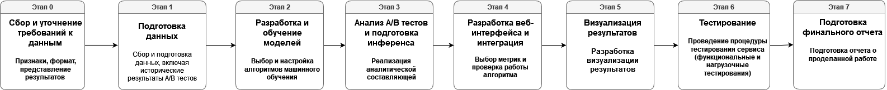

# Дизайн ML системы - Оптимизация А/Б тестирования с помощью машинного обучения

## 1. Цели и предпосылки

### 1.1. Зачем идем в разработку продукта?

Сегодня А/Б тестирование - это основной метод научного доказательства влияния изменений в продукте на метрики, который повсеместно используется. Тем не менее, А/Б тестирование часто либо невозможно, либо недостаточно данных для проведения теста, либо для достижения заданного уровня значимости и мощности тест длится слишком долго. Таким образом, цели данного проекта:
1. Улучшение скорости проведения A/B тестов и уменьшение дисперсии теста с использованием машинного обучения.
2. Решение проблемы малых выборок, а также проведение аналогов A/B тестов там, где разбиение на группы невозможно (с использованием синтетического контроля и прогнозирования).
3. Повышение шансов обнаружения гипотез, которые улучшат целевые метрики и приведут к увеличению прибыли. Экономия времени, затрачиваемого на тесты, может быть перераспределена на другие задачи, способствуя росту прибыли.

- **Бизнес-цель:** С помощью машинного обучения можно уменьшить дисперсию теста, тем самым ускоряя его и решить проблему маленьких выборок, а также провести аналог А/Б теста там, где разбиение на группы невозможно (синтетический контроль и прогнозирование). Ускоряя тесты, мы помогаем бизнесу проводить больше тестов, а чем больше тестов мы можем провести, тем больше шанс найти гипотезы, которые улучшат целевые метрики и приведут к росту прибыли. А потенциальная экономия времени, которое тратится на тесты может потратиться также и на дргие задачи, что может помочь бизнесу также увеличить прибыль за счет сокращения времени.
  
- **Почему станет лучше, чем сейчас, от использования ML:** Машинное обучение либо улучшает существующие методы (CUPED) оптимизации экспериментов, либо предлагает принципиально новые методы (синтетический контроль), которые невозможны без ML. Наш проект позволит ускорить скорость выполнения теста.

- **Что будем считать успехом итерации с точки зрения бизнеса:** Работающий сервис по применению ML в экспериментах, доказанная эффективность (уменьшения доверительного интервала относительно классических критериев и CUPED) предложенных ML методах на синтетических (смоделированных) данных и доступных датасетах, готовый отчет и дизайн-док по проекту.

### 1.2. Бизнес-требования и ограничения

**Целевое решение:** Сервис по применению машинного обучения для оптимизации и проведения АБ-тестов. Сервис позволяет провести синтетический тест или уменьшить дисперсию текущего для того, чтобы сократить время, которое требуется для тестов. 

### Логика работы

1. В веб-интерфейсе пользователь выбирает, что необходимо сделать - провести тест с синтетическим контролем или уменьшить дисперсию текущего теста.
2. Загружает данные в веб-интерфейс.
3. Сервис обучает модель, подбирает гиперпараметры, рассчитывает статистические критерии.
4. Пользователю выводится результат - анализ А/Б теста со всей необходимой информацией после применения ML.
Use-Case 1: Запуск A/B теста с использованием синтетического контроля

Участники: Аналитик, менеджер по продукту, разработчик.

Цель: Запустить A/B тест для оценки влияния изменений в продукте на ключевые метрики, используя синтетический контроль для контрольной группы.

Основные шаги:

1. Аналитик входит в веб-интерфейс сервиса и выбирает опцию "Создать новый A/B тест".
2. Загружает необходимые данные о тесте, включая характеристики пользователей и метрики, которые требуется оценить.
3. Сервис обучает модель машинного обучения на основе предоставленных данных и создает синтетический контроль для контрольной группы.
4. Аналитик настраивает параметры теста, такие как уровень значимости и длительность теста.
5. Модель машинного обучения проводит анализ результатов теста и предоставляет выводы, включая оценку влияния изменений на метрики и уровень статистической значимости.
6. Аналитик и менеджер по продукту анализируют результаты и принимают решение о дальнейших шагах на основе данных от сервиса.

## Бизнес-ограничения

- Сервис на первой итерации работает с поюзерными тестами с непрерывными целевыми метриками.
- Уменьшение дисперсии зависит от предсказательной силы модели для данных пользователя и не всегда будет приводить к существенному сокращению дисперсии.
- Для корректной работы синтетического контроля метрика должна представлять из себя стационарный временной ряд, чтобы прогноз модели был адекватен.
- Не предполагает использования для A/B/C/n тестирования.
- Модель должна отрабатывать за ограниченное кол-во времени (не дольше 10 минут).
- Первоначально модель должна быть расчитана на максимальную нагрузку 10 запросов минуту
- Данные для загрузки в сервис должны быть строго по формату
## Критерии успеха

- Доказанная эффективность (уменьшения доверительного интервала относительно классических критериев и CUPED) предложенных ML методах на синтетических (смоделированных) данных и доступных датасетах.
- Обучение моделей и подсчет статистических критериев для тестов происходит в соответствии с установленными ограничениями по времени и нагрузке.
- Веб-интерфейс обеспечивает удобную загрузку данных и предоставляет пользователю полный анализ результатов A/B тестирования, включая статистические выводы.
- Система должна быть легко масштабируемой для обеспечения возможности добавления новых пользователей и увеличения нагрузки без существенных изменений в архитектуре

### 1.3. Что входит в скоуп проекта/итерации, что не входит

- **На закрытие каких БТ подписываемся в данной итерации:** реализация веб-интерфейса, мл-составляющая, аналитическая составляющая, визуализация.
  
- **Результат с точки зрения качества кода и воспроизводимости решения:** Отдельный репозиторий с приложением streamlit и fast-api. Используется модульный подход, где каждый модуль отвечает за свою часть – предобработка данных, моделирование, визуализация и т.д.
  
- **Описание планируемого технического долга (что оставляем для дальнейшей продуктивизации):** Добавить логирование, авторизацию пользователей, потоковая обработка данных с экспериментов, отдельное API с реализованными методами.

### 1.4. Предпосылки решения

- Методы для тестирования известны, но отсутствует понятная реализация, которая позволила бы компаниям и получать качественный результат с применением ML без очень глубокой экспертизы в данной области. На текущий момент отсутствует.
- Согласованность с бизнес-процессами компании, так как внедрение новых методов A/B тестирования и инфраструктуры может потребовать изменений в существующих процессах, что влечет за собой дополнитнльные траты и нагрузку для компании.
- Наличие доступных и качественных данных для проведения A/B тестирования, а также для обучения моделей машинного обучения. Это включает в себя как исторические данные по экспериментам, так и данные, необходимые для синтетического контроля.

## 2. Методология 

### 2.1. Постановка задачи

Аналитическая и ML часть проекта будут состоять из следующих компонент:

- Увеличение чувствительности тестов с помощью ML - реализация CUPED, CUPAC, CUNOPAC, автоматизация обучения модели и выбор наиболее подходящего метода сокращения дисперсии.
- Проведение тестов без возможности разделения на тест и контроль - синтетический контроль в виде ML-прогноза целевой метрики на основе исторических данных.

### 2.2. Блок-схема решения

### 2.3. Этапы решения задачи 

1. **Подготовка данных и моделирование синтетических данных:**
   - Сбор и подготовка данных, включая исторические результаты A/B тестов и характеристики пользователей.
   - Разработка скриптов и моделей для создания синтетических контрольных групп.

2. **Разработка и обучение моделей машинного обучения:**
   - Выбор и настройка алгоритмов машинного обучения для оптимизации A/B тестов.
   - Разработка моделей для прогнозирования метрик в синтетических контрольных группах.
   - Реализация автоматизации обучения и подбора гиперпараметров моделей.

3. **Анализ A/B тестов и статистическая обработка данных:**
   - Реализация аналитической составляющей, включая расчет p-value, доверительных интервалов и статистических критериев.
   - Подготовка инференса моделей и расчета аналитики для результатов тестов.

4. **Разработка веб-интерфейса и интеграция:**
   - Разработка веб-интерфейса для загрузки данных и настройки A/B тестов.
   - Интеграция разработанных моделей машинного обучения и аналитических инструментов в веб-сервис.

5. **Визуализация результатов:**
   - Разработка визуализации результатов A/B тестов в веб-интерфейсе для удобного анализа пользователями.

6. **Тестирование:**
   - Проведение функционального тестирования для проверки правильности работы всех компонентов системы.
   - Проведение нагрузочного тестирования для оценки производительности системы под нагрузкой.

7. **Подготовка финального отчета:**
   - Подготовка подробного отчета о проделанной работе, методологии и результатов, доступного для пользователей.

## 3. Подготовка пилота

### 3.1. Способ оценки пилота
Для оценки успешности пилота будут использованы следующие метрики и процедуры:

Уровень значимости и статистическая мощность: 
- Мы оценим, насколько пилотные A/B тесты, проведенные с применением машинного обучения, способны обнаруживать статистически значимые различия между контрольной и тестовой группами. Успешным считается пилот, если достигнуты заранее установленные уровни значимости и мощности.

- Скорость выполнения тестов: Мы сравним время, необходимое для проведения A/B тестов с использованием машинного обучения и без него. Успешным пилотом будет считаться, если сокращение времени будет достаточно значительным.

- Оценка экономической эффективности: Мы оценим экономическую пользу от сокращения времени, затрачиваемого на тестирование, и увеличение количества тестов. Если пилот позволит снизить издержки и/или увеличить прибыль, он будет признан успешным.

### 3.2. Что считаем успешным пилотом
Пилот будет считаться успешным, если выполняются следующие условия:

Удалось достичь уровней значимости и мощности, позволяющих надежно обнаруживать статистически значимые различия в A/B тестах.

Время, затрачиваемое на проведение A/B тестов, было существенно сокращено по сравнению с предыдущими методами.

Обнаружена экономическая выгода от применения машинного обучения в A/B тестировании, такая как увеличение количества проведенных тестов, увеличение прибыли или снижение издержек.

### 3.3. Подготовка пилота

## 4. Внедрение 

### 4.1. Архитектура решения

Архитектура решения будет включать в себя следующие компоненты:

Веб-интерфейс: Пользователи будут иметь доступ к веб-интерфейсу для загрузки данных и настройки A/B тестов.

Модели машинного обучения: Модели для оптимизации A/B тестов и прогнозирования результатов будут развернуты в сервисе.

Службы автоматизации: Сервис будет включать компоненты для автоматической настройки моделей и расчета статистических критериев.

### 4.2. Описание инфраструктуры и масштабируемости

### 4.3. Требования к работе системы

### 4.4. Безопасность системы

### 4.5. Безопасность данных

### 4.6. Издержки

### 4.5. Integration points

### 4.6. Риски